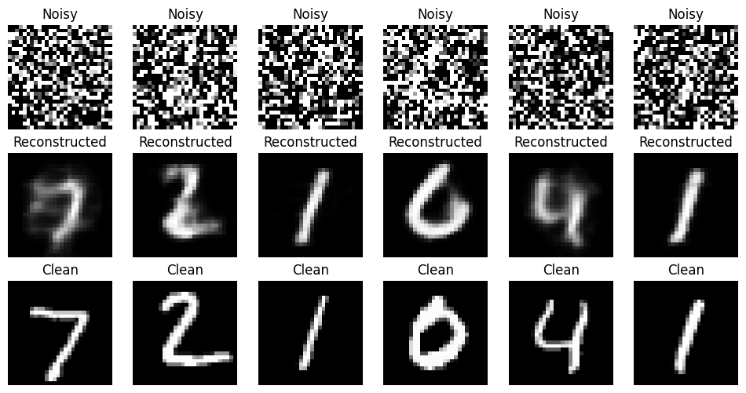
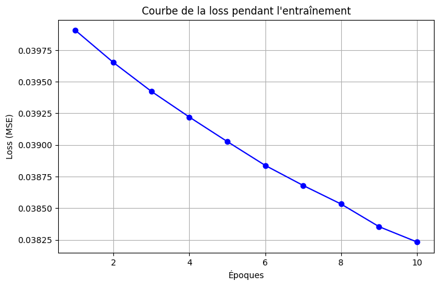

<div align="center">

# 🔬 Autoencodeur-avec-pytorch-sur-le-dataset-MINST

**Autoencodeur convolutionnel pour la reconstruction d'images corrompues par bruit gaussien**

[](https://python.org)
[](https://pytorch.org)
[](LICENSE)
[]()

</div>

---

## 📸 Résultats visuels

<div align="center">

### Noisy · Reconstructed · Clean



*De gauche à droite : 7, 2, 1, 0, 4, 1 — le modèle reconstruit fidèlement chaque chiffre malgré un bruit intense*

</div>

---

## 📉 Courbe d'apprentissage

<div align="center">



</div>

| Époque | Loss (MSE) | Δ |
|:------:|:----------:|:-:|
| 1 | 0.0399 | — |
| 2 | 0.0397 | ↓ 0.0002 |
| 3 | 0.0394 | ↓ 0.0003 |
| 4 | 0.0392 | ↓ 0.0002 |
| 5 | 0.0390 | ↓ 0.0002 |
| 6 | 0.0388 | ↓ 0.0002 |
| 7 | 0.0387 | ↓ 0.0001 |
| 8 | 0.0385 | ↓ 0.0002 |
| 9 | 0.0384 | ↓ 0.0001 |
| **10** | **0.0382** | ↓ 0.0002 |

> **Test Loss final : `0.0428`** — convergence stable et régulière sur 10 époques

---

## 🎯 Objectifs du projet

```
✦ Charger et normaliser le dataset MNIST
✦ Corrompre les images avec du bruit gaussien
✦ Entraîner un autoencodeur convolutionnel à reconstruire les images propres
✦ Évaluer la qualité via MSE, PSNR et SSIM
✦ Visualiser les résultats (Noisy → Reconstructed → Clean)
```

---

## ⚙️ Installation

```bash
# Cloner le projet
git clone https://github.com/tchongwangbakayoo619-star/Autoencodeur-avec-pytorch-sur-le-dataset-MINST.git
cd Autoencodeur-avec-pytorch-sur-le-dataset-MINST

# Installer les dépendances
pip install torch torchvision matplotlib scikit-image
```

---

## 🚀 Utilisation

```bash
python train.py
```

MNIST est téléchargé automatiquement via `torchvision.datasets` au premier lancement.

---

## 🏗️ Architecture

```
                    ┌─────────────────────────────────────────┐
  Image propre      │              AUTOENCODEUR               │
  (1 × 28 × 28)     │                                         │
       │            │  ╔══════════════╗   ╔════════════════╗  │
       ▼            │  ║   Encodeur   ║   ║   Décodeur     ║  │
  + bruit gaussien  │  ║              ║   ║                ║  │
       │            │  ║  Conv2d      ║   ║  ConvTranspose ║  │
       ▼            │  ║  → ReLU      ║──▶║  → ReLU        ║  │
  Image bruitée ───▶│  ║  Conv2d      ║   ║  ConvTranspose ║  │
                    │  ║  → ReLU      ║   ║  → ReLU        ║  │
                    │  ║  Conv2d      ║   ║  ConvTranspose ║  │
                    │  ╚══════════════╝   ║  → Sigmoid     ║  │
                    │                    ╚════════════════╝  │
                    └──────────────────────────┬──────────────┘
                                               │
                                               ▼
                                    Image reconstruite
                                      (1 × 28 × 28)
```

### Hyperparamètres

| Paramètre | Valeur |
|---|---|
| Optimiseur | `Adam` |
| Learning rate | `1e-3` |
| Fonction de perte | `MSELoss` |
| Batch size | `64` |
| Époques | `10` |
| Type de bruit | Gaussien |

---

## 📊 Métriques d'évaluation

| Métrique | Description | Interprétation |
|---|---|---|
| **MSE** | Erreur quadratique moyenne pixel à pixel | Plus bas = meilleur |
| **PSNR** | Peak Signal-to-Noise Ratio (en dB) | Plus élevé = meilleur |
| **SSIM** | Similarité structurelle perçue \[0, 1\] | Plus proche de 1 = meilleur |

---

## 📂 Structure du projet

```
denoising-autoencoder-mnist/
│
├── 📁 data/               # Dataset MNIST (téléchargé automatiquement)
├── 📄 train.py            # Script principal — entraînement & évaluation/
├── 📊 loss.png            # Courbe de la loss par époque
├── 🖼️  output.png         # Grille Noisy / Reconstructed / Clean
└── 📄 README.md
```

---

## 🔮 Améliorations possibles

- [ ] **Validation set** — ajouter un split validation avec `random_split`
- [ ] **U-Net** — tester une architecture skip-connection pour de meilleures reconstructions
- [ ] **Niveaux de bruit variables** — expérimenter avec différents `sigma`
- [ ] **LR Scheduler** — `CosineAnnealingLR` ou `ReduceLROnPlateau`
- [ ] **Baseline MLP** — comparer avec un autoencodeur fully-connected
- [ ] **Autres types de bruit** — sel & poivre, flou gaussien, occlusion

---

## 🛠️ Stack technique

| Outil | Rôle |
|---|---|
| `PyTorch` | Définition du modèle, entraînement, inférence |
| `torchvision` | Chargement et transformations MNIST |
| `matplotlib` | Visualisations (loss curve, grille d'images) |
| `scikit-image` | Calcul PSNR et SSIM |

---

<div align="center">

*Projet Deep Learning — Autoencodeur convolutionnel débruiteur · PyTorch · MNIST*

</div>
